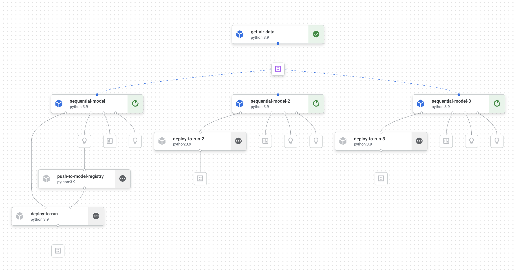

# MLOps-with-Vertex-ImpactAnalytics-Workshop

## Description
The purpose of this repository was to demonstrate creation of kubeflow ML pipelines for Impact analytics.
### Step 1 : Build and Push Base Container image
A Docker container image is a lightweight, standalone, executable package of software that includes everything needed to run an application: code, runtime, system tools, system libraries and settings. We have created a base container image which have all dependencies installed. Since, all dependencies are installed in the base container image, we do not have to install the dependencies for every custom component repeatedly. We passed this container image to all the custom components and the kubeflow pipeline.
### Step 2: Defining the pipeline components
A pipeline component is a self-contained set of code that performs one step in your ML workflow. 
Below are the main parts of the component definition:
- Metadata: Name, description, and other metadata.
- Interface (inputs and outputs): Name, type, default value.
- Implementation: How to run the component, given the input arguments.

We have defined 3 pipeline components for creating dataset, for training and evaluation and for deploying the model. We were required to create 3 custom components as we were training our models using DARTS package.
 
 
**a) Fetching data**  
The *get_air_data* component is used to fetch data from bigquery and its output will be passed as input to the training component
 
 
**b) Training and Evaluation of model**  
The *sequential_model* component is used for model training and evaluation. We have transformed the data, created and saved the darts model based on model type parameter and evaluate model based on MAPE, MSE, and RMSE metrics. This metrics got log in the metadata using metrics output which can be seen in the console. We have logged hyperparameters of the model in metadata using model output which can be seen in the console.
 
 
**c) Model Logging**  
The *push_to_model_registry* component is for uploading the model to Model Registry. This is to log the models and keep track of different versions.
 
 
**d) Model Deployment**  
The *deploy_to_run* component is for deploying model. We have used Cloud Build to automate builds and deployments to Cloud Run by using Cloud Build trigger to automatically build and deploy our code whenever new commits are pushed to our Git repository. Here we are pushing our trained model to the Git repository.
 

### Step 3: Defining the pipeline
In this stage we have defined the pipeline. We passed output of get_air_data component to sequential_model component, and the output of sequential_model component to deploy_to_run component. Pipeline compiler will compile the pipeline and store the pipeline configuration inside a JSON file.

### Step 4: Running the Pipeline Job
After we created the pipeline, we submitted pipeline job for execution. Thus a complete end to end kubeflow pipeline is created.

## Authors and acknowledgment
- Monark Unadkat
- Pratik Karnik
- Aayush Dheemar
- Kapil Musale
- Rishabh Pandit

## License
For open source projects, say how it is licensed.

